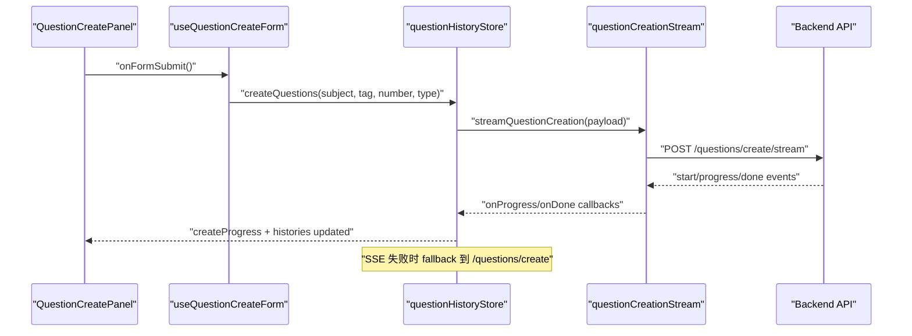
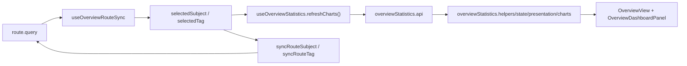

# ChatCNU 项目结构与架构详解（是什么 + 为什么）

## 1. 文档目标

这份文档面向两类场景：

1. 新成员快速理解项目结构与代码分层。
2. 现有成员在扩展功能时，明确“代码应该放在哪里、为什么这样放”。

本文会按项目目录组织说明，并在每个关键模块给出代表性代码片段，解释：

- 是什么：这个模块做了什么。
- 为什么：为什么这样设计，而不是把逻辑混在一起。

---

## 2. 技术栈与总体分层

**技术栈**

- 前端框架：Vue 3 + Composition API + `<script setup lang="ts">`
- 状态管理：Pinia
- 路由：Vue Router 4
- UI：PrimeVue + Tailwind CSS
- 图表：Chart.js
- 工具库：@vueuse/core
- 构建工具：Vite

**总体分层**

```text
UI 层（views / feature components）
  -> 组合逻辑层（features/*/composables）
    -> 状态层（stores）
      -> 服务与网络层（services / axios）
        -> 后端 API
```

为什么这样分层：

- UI 层只负责展示和交互，不承担复杂副作用。
- 组合逻辑层复用状态推导和异步流程，避免组件膨胀。
- 状态层集中跨组件数据，避免“谁都能改状态”。
- 服务与网络层隔离请求细节，保证接口变更影响范围可控。

---

## 3. 项目目录地图（按职责）

```text
src/
  main.ts
  App.vue
  router/
    index.ts
  stores/
    userStore.ts
    questionHistoryStore.ts
    *.helpers.ts
  services/
    questionCreationStream.ts
  features/
    auth/
      composables/
    questions/
      components/
      composables/
    overview/
      components/
      composables/
      mocks/
    profile/
      components/
      composables/
    layout/
      components/
  views/
    LandingView.vue
    LoginView.vue
    RegisterView.vue
    BackPasswordView.vue
    QuestionsView.vue
    OverviewView.vue
    ProfileView.vue
  types/
    index.ts
```

根目录关键配置：

- `vite.config.ts`：构建与别名。
- `eslint.config.js`：静态检查规则。
- `tailwind.config.js` + `postcss.config.js`：样式编译链路。
- `package.json`：开发、构建、检查脚本。

---

## 4. 启动链路（`main.ts` -> `App.vue` -> `router`）

### 4.1 应用启动：`src/main.ts`

关键代码：

```ts
const app = createApp(App)

app.use(createPinia())
app.use(router)
app.use(PrimeVue, { theme: { preset: Noir } })
app.use(ToastService)
app.use(ConfirmationService)
app.directive('tooltip', Tooltip)

app.mount('#app')
```

是什么：

- 创建根应用，注册状态、路由、UI 插件，最后挂载。

为什么：

- 所有全局依赖都在单一入口初始化，避免插件注册散落在业务模块里，降低排障难度。

### 4.2 根布局：`src/App.vue`

关键代码：

```vue
<AppHeaderBar />
<div class="flex-1 ...">
  <RouterView />
</div>
```

是什么：

- 根组件只做壳层布局，页面内容交给路由视图。

为什么：

- 根组件保持“薄”，后续新页面接入只改路由，不改全局壳层。

### 4.3 路由守卫：`src/router/index.ts`

关键代码：

```ts
router.beforeEach((to) => {
  if (!to.meta.requiresAuth) return true
  const userStore = useUserStore()
  if (userStore.isAuthenticated) return true
  return { name: ROUTE_NAMES.login, query: { redirect: to.fullPath } }
})
```

是什么：

- 对标记 `requiresAuth` 的路由做统一鉴权。

为什么：

- 把鉴权收敛在路由层，防止每个页面重复写登录判断。

---

## 5. 基础设施层（配置、请求、主题）

### 5.1 环境配置：`src/config.ts`

关键代码：

```ts
function getRequiredEnv(name: keyof ImportMetaEnv): string {
  const value = import.meta.env[name]
  if (typeof value !== 'string' || value.trim().length === 0) {
    throw new Error(`Missing required environment variable: ${name}`)
  }
  return value
}
```

是什么：

- 统一读取必填环境变量（如 API 地址）。

为什么：

- 在启动阶段直接失败，避免运行时出现“静默错误地址”。

### 5.2 请求实例：`src/axios.ts`

关键代码：

```ts
const PUBLIC_ENDPOINTS = new Set(['/login', '/register'])

axiosInstance.interceptors.request.use((config) => {
  if (isPublicEndpoint(config.url)) return config
  const token = useUserStore().token
  if (token) {
    config.headers = config.headers ?? {}
    config.headers.Authorization = token
  }
  return config
})
```

是什么：

- 统一处理请求基址和 token 注入，公开接口自动跳过鉴权头。

为什么：

- 避免每个业务请求手写 token 逻辑，减少重复与遗漏风险。

### 5.3 主题：`src/theme.ts`

是什么：

- 基于 PrimeVue `Aura` 主题定义 `Noir` 色板（浅色/深色）。

为什么：

- 设计令牌集中维护，避免组件里硬编码颜色。

---

## 6. 状态层（Pinia）

### 6.1 用户与偏好状态：`src/stores/userStore.ts`

关键代码：

```ts
const user = useStorage<UserState>(USER_STORAGE_KEY, normalizeUserState(EMPTY_USER), ...)
const isAuthenticated = computed(() => user.value.token !== '')
const setUser = (next: UserState) => { user.value = normalizeUserState(next) }
const clearUser = () => { user.value = { ...EMPTY_USER } }
```

是什么：

- 管理登录态与用户信息；同时提供 `useUserSettingsStore` 管理深色模式、题目展示偏好、模型选择。

为什么：

- 用户状态是跨页面共享数据，必须有唯一可信来源，避免各组件维护各自副本。

### 6.2 题单历史状态：`src/stores/questionHistoryStore.ts`

关键代码（流式创建 + fallback）：

```ts
await streamQuestionCreation({
  baseUrl: API_BASE_URL,
  token: token.value || '',
  payload: requestPayload,
  onStart, onProgress, onDone: applyCreateDonePayload,
})
```

```ts
catch (streamError) {
  try {
    await createWithFallback(requestPayload)
  } catch (fallbackError) {
    createError.value = ...
  }
}
```

是什么：

- 负责历史记录拉取、删除、进度更新、题目创建状态机。

为什么：

- 将“创建题目”长流程统一放在 store，组件只消费状态，不直接拼流程。

### 6.3 Store 辅助函数：`src/stores/*.helpers.ts`

是什么：

- 放置纯函数：payload 构建、进度归一化、不可变数组更新、兼容旧存储结构。

为什么：

- 把可测试的纯逻辑抽离出 store，降低耦合并提升复用性。

---

## 7. 业务域：Auth（登录/注册/找回）

### 7.1 结构

```text
features/auth/composables/
  useLoginForm.ts
  useRegisterForm.ts
  usePasswordRecovery.ts
views/
  LoginView.vue
  RegisterView.vue
  BackPasswordView.vue
```

### 7.2 登录流程：`useLoginForm.ts`

关键代码：

```ts
const response = await axios.post<Response<LoginData>>('/login', {...})
userStore.setUser({...})
userSettingsStore.setAvailableModels(loginModels)
await router.push(getRedirectPath())
```

是什么：

- 管理登录表单、校验、提交、错误信息和登录后的跳转。

为什么：

- 登录逻辑集中在 composable，`LoginView.vue` 保持展示层职责。

### 7.3 注册流程：`useRegisterForm.ts`

关键代码：

```ts
const canSubmit = computed(() => ... && isTermsAccepted.value)
const passwordStrength = computed<PasswordStrengthState>(() => { ... })
```

是什么：

- 管理角色、注册字段、密码强度、条款确认、提交状态。

为什么：

- 把高频输入状态与验证规则抽离，避免视图层出现大量 if/else。

### 7.4 密码找回：`usePasswordRecovery.ts`

是什么：

- 当前是前端 mock 流程（验证码倒计时、校验、重置提示）。

为什么：

- 在后端接口未接入前仍可跑通页面交互，便于联调和 UI 验证。

---

## 8. 业务域：Questions（出题/作答/历史）

### 8.1 结构

```text
views/QuestionsView.vue
features/questions/
  components/
    QuestionSidebar.vue
    QuestionCreatePanel.vue
    AnswerPanel.vue
    QuestionList.vue
    QuestionListItem.vue
    history/*
  composables/
    useQuestionSidebar.ts
    useQuestionCreateForm.ts
    useAnswerPanelState.ts
    useQuestions.ts
    useAttempts.ts
    useQuestionAutoSave.ts
    useSubmit.ts
    useQuestionListState.ts
    useQuestionElapsedTimer.ts
```

### 8.2 页面编排：`QuestionsView.vue`

关键代码：

```vue
<QuestionSidebar v-model:selected="selectedHistoryId" ... />
<AnswerPanel v-if="selectedHistoryId !== -1" :history-id="selectedHistoryId" />
<QuestionCreatePanel v-else />
```

是什么：

- 左侧历史/筛选，右侧在“作答面板”和“创建面板”之间切换。

为什么：

- 将“选择历史记录”和“具体作答”解耦，结构清晰且易扩展。

### 8.3 拉题与拉作答记录：`useQuestions.ts` / `useAttempts.ts`

关键代码：

```ts
let controller: AbortController | null = null
const cancel = () => { controller?.abort(); ... }
```

是什么：

- 分别请求题目列表和历史作答，并支持取消请求。

为什么：

- 当 `historyId` 切换很快时，避免旧请求覆盖新状态（竞态问题）。

### 8.4 自动保存与进度同步：`useQuestionAutoSave.ts` + `QuestionList.vue`

关键代码：

```ts
watch(attempts, () => {
  queueSave(questionId, answers)
}, { deep: true })
```

```ts
watch(savedProgress, (progress) => {
  historyStore.updateHistoryProgress(historyId, progress)
})
```

是什么：

- `useQuestionAutoSave` 负责每道题的防抖保存（`POST /questions/save`），并维护单题保存状态（`idle/saving/saved/error`）。
- `QuestionList.vue` 订阅 `savedProgress`，把“已保存且有答案题数 / 总题数”实时回写到侧边栏进度条。

为什么：

- 将“保存队列 + 版本防旧包回写 + 进度计算”集中在 composable，避免列表组件膨胀。
- 自动保存成功即更新进度，用户对当前学习状态有即时反馈。

### 8.5 提交答案：`useSubmit.ts` + `QuestionList.vue`

关键代码：

```ts
await flush()
const result = await submit({ historyId, answers })
```

```ts
await axios.post('/attempt', {
  history_id: historyId,
  answers,
})
```

是什么：

- 提交前先 `flush` 自动保存队列，确保后端收到的是用户最后一次编辑答案。
- 使用新版批量 `POST /attempt` 一次提交整套答案，后端返回 `summary`（总题数、正确数、正确率）。

为什么：

- 接口语义更清晰（提交是“整套结果结算”而不是单题散提）。
- 减少网络请求风暴，前端状态收敛更简单。

### 8.6 重置流程：`QuestionList.vue` + `questionHistoryStore.resetHistory`

关键代码：

```ts
confirm.require({
  accept: () => void performReset(),
})
```

```ts
await historyStore.resetHistory(historyId) // POST /history/reset
resetState()
historyStore.updateHistoryProgress(historyId, 0)
```

是什么：

- 用户确认后调用后端 `/history/reset`，成功后再重置本地作答、计时器与自动保存状态。
- 重置完成后触发 `reset-completed`，由上层重新拉取 attempts 对齐后端。

为什么：

- 保证“后端状态”和“前端界面状态”一致，避免只清本地造成数据错觉。
- 把 reset API 调用下沉到 store，组件层只处理交互与反馈。

### 8.7 面板状态协调：`useAnswerPanelState.ts` + `useQuestionListState.ts`

是什么：

- `useAnswerPanelState` 负责“题目 + 既有作答”融合。
- 同时根据 attempts 的 `is_submitted` 聚合判定“已提交锁定”，确保历史已提交题集不可继续作答。
- `useQuestionListState` 负责折叠态、已答态、重置态同步。

为什么：

- UI 状态拆层后，`QuestionList.vue` 专注渲染和事件转发。
- 将“可编辑/不可编辑”规则统一放在状态协调层，避免散落在多个组件出现判定不一致。

### 8.8 流式创建题目服务：`services/questionCreationStream.ts`

关键代码：

```ts
while (true) {
  const { value, done } = await reader.read()
  ...
  processBlock(block)
}
if (!streamDone) {
  throw new Error('Stream ended before receiving done event')
}
```

是什么：

- 解析 SSE 事件（`start/progress/done`），把流式返回转换成结构化回调。

为什么：

- 将流处理细节封装在服务层，store 只处理业务状态，不直接处理字节流。

---

## 9. 业务域：Overview（统计看板）

### 9.1 结构

```text
views/OverviewView.vue
features/overview/
  composables/
    useOverviewStatistics.ts
    useOverviewRouteSync.ts
    overviewStatistics.api.ts
    overviewStatistics.helpers.ts
    overviewStatistics.state.ts
    overviewStatistics.presentation.ts
    overviewStatistics.charts.ts
    overviewStatistics.share.ts
  components/
    OverviewToolbar.vue
    OverviewDashboardPanel.vue
    OverviewKpiGrid.vue
    OverviewChartsPanel.vue
    OverviewInsightsPanel.vue
  mocks/
    overviewDashboardMock.ts
```

### 9.2 看板核心编排：`useOverviewStatistics.ts`

关键代码：

```ts
const overviewData = await fetchOverviewDashboardData(...)
const nextSubjects = buildUniqueNonEmptyStrings(...)
const subjectDetail = await fetchOverviewSubjectDashboardData(...)
updateAccuracyTrendChart(...)
updateAttemptsStackedChart(...)
updateKpiCards(...)
```

是什么：

- 统一管理选中科目/标签、接口请求、图表数据、KPI/洞察、分享行为。

为什么：

- 看板逻辑跨度大（路由 + API + 派生计算 + 图表），必须有一个“总编排器”。

### 9.3 路由同步：`useOverviewRouteSync.ts`

关键代码：

```ts
watchIgnorable(routeQuery, (query) => { ...selectedSubject.value = querySubject... })
watchIgnorable(selectedSubject, (subject) => { syncRouteSubject(subject); void refreshCharts() })
```

是什么：

- 双向同步 URL query 与页面状态，且避免 watch 循环触发。

为什么：

- 看板支持分享和刷新恢复，需要 URL 可表达当前筛选状态。

### 9.4 模块拆分原则（为什么拆成多个文件）

- `api`：只负责请求和 mock 切换。
- `helpers`：格式化、参数构建、通用转换。
- `state`：周目标、排名、标签选择等状态推导。
- `presentation`：KPI 与 insights 的文案和表达模型。
- `charts`：Chart.js 的数据与配置构建。
- `share`：Web Share / Clipboard 兜底。

这样拆分后，每个模块职责单一，单测和替换成本更低。

---

## 10. 业务域：Profile（资料/偏好/安全）

### 10.1 结构

```text
views/ProfileView.vue
features/profile/
  components/
    ProfileWorkspace.vue
    ProfileSummaryCard.vue
    ProfilePreferencesSection.vue
    ProfileAccountSection.vue
    ProfileSecuritySection.vue
  composables/
    useProfileWorkspace.ts
    profileWorkspace.api.ts
    profileWorkspace.helpers.ts
    profilePasswordState.ts
    profileActivityChart.ts
```

### 10.2 工作区总编排：`useProfileWorkspace.ts`

关键代码：

```ts
const saveName = async () => { ... await submitProfileUpdate(...); userStore.patchUser(...) }
const saveEmail = async () => { ... }
const savePassword = async () => { ... }
const logout = async () => { ... userStore.clearUser(); await router.push(...) }
```

是什么：

- 汇总资料页所有状态与动作：名称、邮箱、密码、用户 ID 复制、登出、趋势图数据。

为什么：

- 将“跨多个卡片的共享状态”集中，避免子组件之间互相耦合。

### 10.3 密码规则：`profilePasswordState.ts`

关键代码：

```ts
const passwordRules = computed(() => [...])
const passwordError = computed(() => {
  if (!hasPasswordInput.value) return ''
  if (passwordMismatch.value) return 'Passwords do not match.'
  if (passwordScore.value < 3) return 'Password is too weak...'
  return ''
})
```

是什么：

- 提供密码规则、强度、错误信息、可提交状态。

为什么：

- 密码校验是独立业务规则，抽成纯逻辑 composable 更容易复用和测试。

### 10.4 活动图表：`profileActivityChart.ts`

是什么：

- 请求 `/profile/trend`，构建最近 7 天正确/错误堆叠图。

为什么：

- 图表转换逻辑与表单逻辑分离，复杂度分散，Profile workspace 更易维护。

---

## 11. 布局域：`features/layout`

### 11.1 顶部栏：`AppHeaderBar.vue`

是什么：

- 提供全局导航（题目/统计/资料）和全局设置弹窗（深色模式、题目展示偏好、模型）。

为什么：

- 把“全局入口能力”放在壳层组件，不与业务页面耦合。

### 11.2 动作按钮：`AppHeaderActionButton.vue`

是什么：

- 统一图标按钮的 hover/active/router 匹配效果。

为什么：

- 消除重复 UI 代码，提高头部交互一致性。

---

## 12. 类型契约层：`src/types/index.ts`

关键代码：

```ts
export interface Response<T> {
  code: number
  info: string
  data: T
}
```

是什么：

- 统一后端响应、领域实体、统计数据、流式事件等类型契约。

为什么：

- 明确前后端边界，降低“字段名错写/语义不一致”导致的运行时错误。

---

## 13. 配置层（根目录）

### 13.1 `vite.config.ts`

是什么：

- 注册 Vue 插件和 PrimeVue 自动导入解析器，配置 `@ -> src` 别名。

为什么：

- 缩短导入路径，减少组件手工注册样板代码。

### 13.2 `eslint.config.js`

是什么：

- 使用 Vue Essential + TypeScript + Prettier 兼容配置。

为什么：

- 保证团队协作中的代码质量和风格一致性。

### 13.3 `tailwind.config.js` / `postcss.config.js`

是什么：

- 负责 Tailwind 扫描范围、PrimeUI 插件接入和 CSS 后处理。

为什么：

- 样式体系统一入口，避免构建结果随环境波动。

---

## 14. 关键流程图

### 14.1 出题流（流式 + fallback）



### 14.2 看板流（科目与标签联动）



---

## 15. 与现有 docs 的关系

- `docs/overview-dashboard-api.md`：看板主接口字段与示例。
- `docs/overview-subject-tag-api.md`：科目维度细分接口。
- `docs/profile-trend-api.md`：Profile 趋势图接口。

本文件关注“前端代码结构与设计动机”，上面这些文档关注“接口协议细节”。

---

## 16. 扩展建议（落地规则）

新增功能时建议遵循以下规则：

1. 新页面入口放在 `views/`，页面内部只做编排。
2. 业务逻辑优先放 `features/<domain>/composables`，UI 放 `components`。
3. 跨页面共享状态放 `stores/`，不要把共享状态塞进某个页面组件。
4. 网络协议与复杂流处理放 `services/` 或 `<domain>/composables/*.api.ts`。
5. 新接口字段先补 `src/types/index.ts`，再落业务代码。

这套规则的目标是：功能持续增长时，代码仍然可以按职责快速定位和替换。
